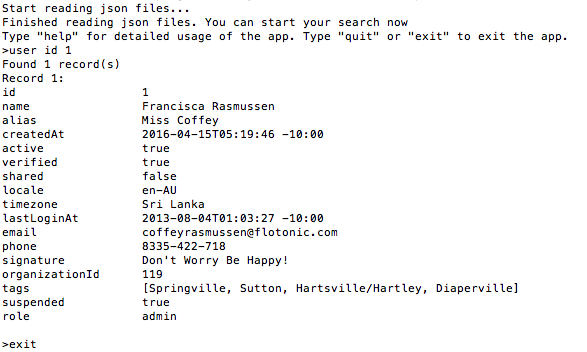

# SimpleSearch

A command line application for searching users, tickets and organizations content read from [json files](src/main/resources/com/simplesearch/services) by exact match.

## Prerequisites
1. [java 1.8](https://www.oracle.com/technetwork/java/javase/downloads/jdk8-downloads-2133151.html)
1. [maven](https://maven.apache.org/install.html) 

For mac, both java 1.8 and maven can also be installed using homebrew

```
brew cask install java8
brew install maven
```

## Installation
Switch to project root directory,

To build the project:
```
mvn clean install
```

To run SimpleSearch Application:
```
mvn exec:java
```




